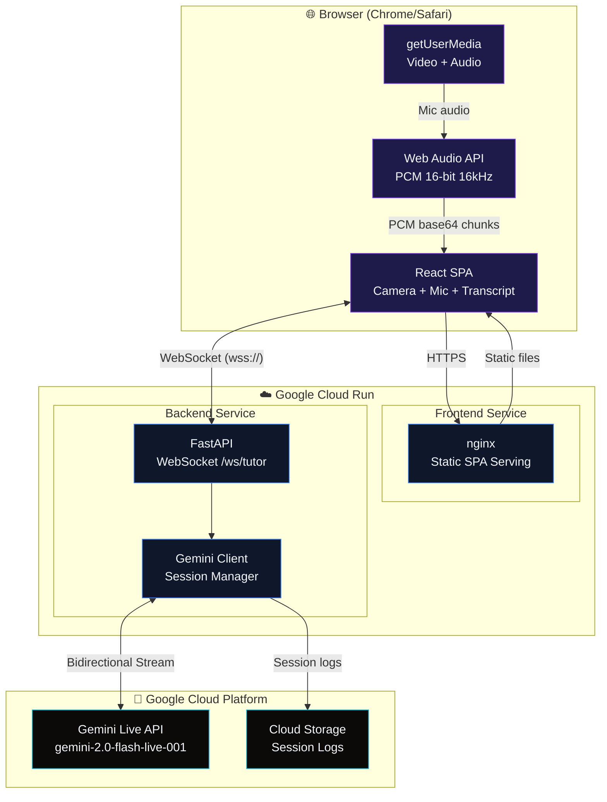

# VisionTutor — Architecture Diagram

## System Architecture

## Data Flow Details

| Path | Data | Format | Direction |
|------|------|--------|-----------|
| Browser → Backend | Mic audio | PCM 16-bit 16kHz, base64 JSON | Client → Server |
| Browser → Backend | Camera frames | JPEG base64 JSON (1 fps) | Client → Server |
| Backend → Gemini | Audio stream | PCM bytes via `send_realtime_input()` | Server → API |
| Backend → Gemini | Video frames | JPEG bytes via `send_realtime_input()` | Server → API |
| Gemini → Backend | Audio response | PCM 16-bit 24kHz via `receive()` | API → Server |
| Gemini → Backend | Transcriptions | Text (input + output) | API → Server |
| Backend → Browser | Audio response | PCM 24kHz base64 JSON | Server → Client |
| Backend → Browser | Transcriptions | JSON text messages | Server → Client |
| Backend → GCS | Session logs | JSON files | Server → Storage |

## GCP Services Used

1. **Google Cloud Run** — Hosts both frontend (nginx) and backend (FastAPI) as serverless containers
2. **Google Cloud Build** — Builds container images during deployment
3. **Google Artifact Registry** — Stores container images
4. **Google Cloud Storage** — Persists session logs for analytics
5. **Gemini Live API** — Powers the AI tutor (bidirectional audio + vision) via Google GenAI SDK
